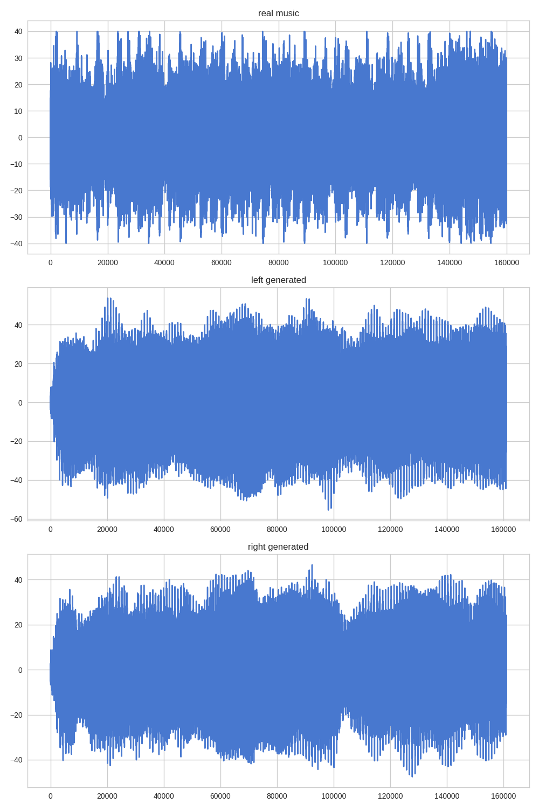
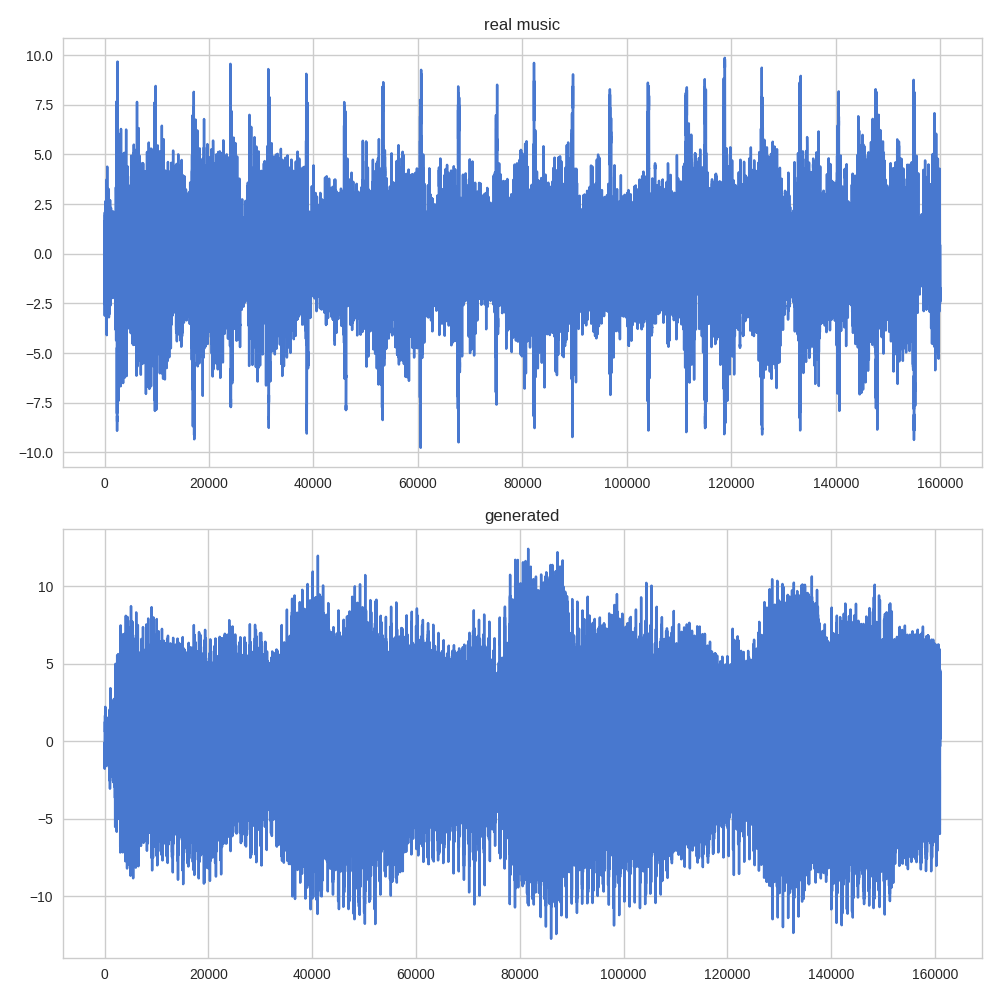
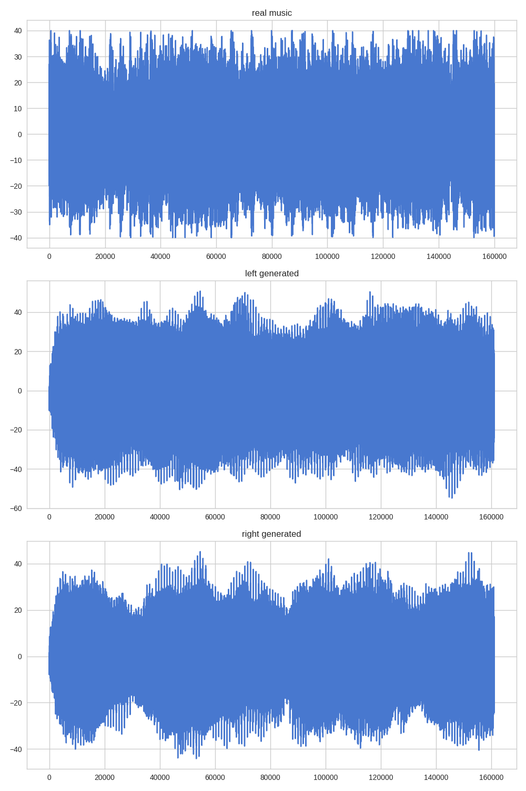
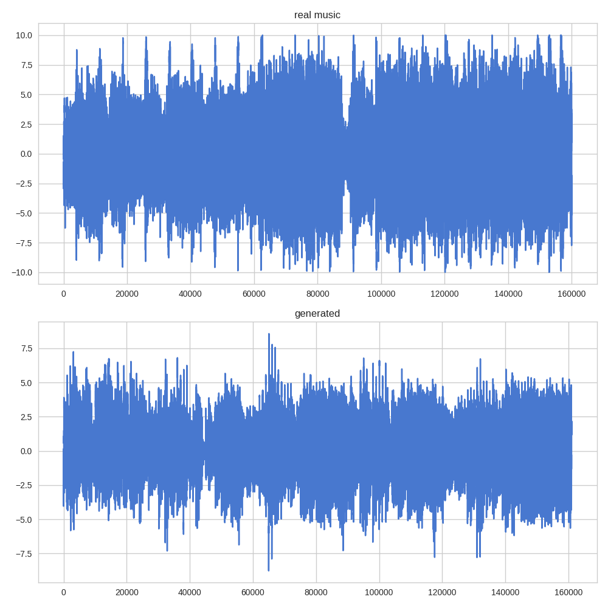

# Generate-Music-Bidirectional-RNN
Generate Music using dynamic bidirectional recurrent neural network Tensorflow


This RNN model will generated 2 outputs, backward and forward. But this game, both are pretty same, different based on initial temperature generated.

```text
batch: 1, loss: 1.03366, speed: 23.2230839729 s / epoch
batch: 2, loss: 1.01434, speed: 22.9636318684 s / epoch
batch: 3, loss: 0.995827, speed: 22.9477238655 s / epoch
batch: 4, loss: 0.977869, speed: 22.9385609627 s / epoch
batch: 5, loss: 0.960333, speed: 22.9393310547 s / epoch
batch: 6, loss: 0.943209, speed: 22.9278440475 s / epoch
batch: 7, loss: 0.926511, speed: 22.9437839985 s / epoch
batch: 8, loss: 0.910224, speed: 22.9244501591 s / epoch
batch: 9, loss: 0.894379, speed: 22.9693090916 s / epoch
batch: 10, loss: 0.879009, speed: 22.9410529137 s / epoch
batch: 11, loss: 0.864144, speed: 23.2230038643 s / epoch
batch: 12, loss: 0.849706, speed: 23.0044908524 s / epoch
batch: 13, loss: 0.835787, speed: 23.0095338821 s / epoch
batch: 14, loss: 0.822327, speed: 23.1483099461 s / epoch
batch: 15, loss: 0.809317, speed: 23.0863668919 s / epoch
batch: 16, loss: 0.796733, speed: 23.0318582058 s / epoch
batch: 17, loss: 0.784547, speed: 23.0388588905 s / epoch
batch: 18, loss: 0.772794, speed: 23.0113451481 s / epoch
batch: 19, loss: 0.761443, speed: 23.0499649048 s / epoch
batch: 20, loss: 0.750422, speed: 23.054156065 s / epoch
```

### Some output






Wave generated seems nice actually, but not in the real sound compression. Just simply a noise try to mimic the real song. I will try to improve in the future.
